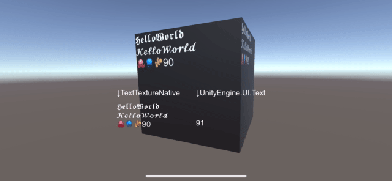

# TextTextureNative


This Unity plugin renders text into Texture2D using UIKit.  
It is possible to display special characters and emoji.



# Requirements
## Platforms
* iOS 15+
* macOS 13+ (Apple Silicon and Intel)

# Installation
## Unity Pakcage Manager (UPM)
Select "Add package from git URL" in the Unity Package Manager and enter the following path.  
[https://github.com/fuziki/TextTextureNative.git?path=Assets/TextTextureNative](https://github.com/fuziki/TextTextureNative.git?path=Assets/TextTextureNative)

# Usage

```c#
var uuid = "hoge"

var texture = TextTextureNativeManager.MakeTexture(uuid, 512, 512, 2);

TextTextureNativeManager.Render(uuid, "𝕳𝖊𝖑𝖑𝖔𝖂𝖔𝖗𝖑𝖉\n𝓗𝓮𝓵𝓵𝓸𝓦𝓸𝓻𝓵𝓭\n🐙🪼🫚", 24, Color.white);
```
